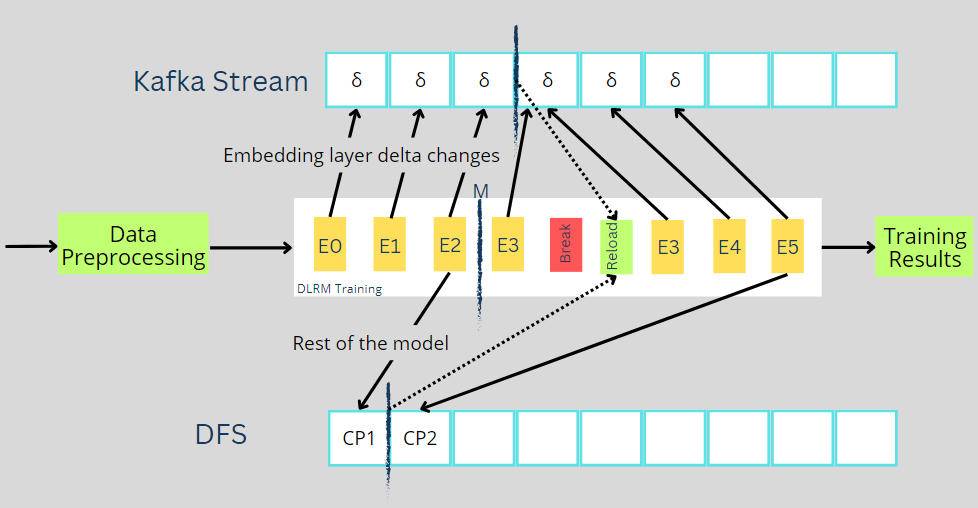
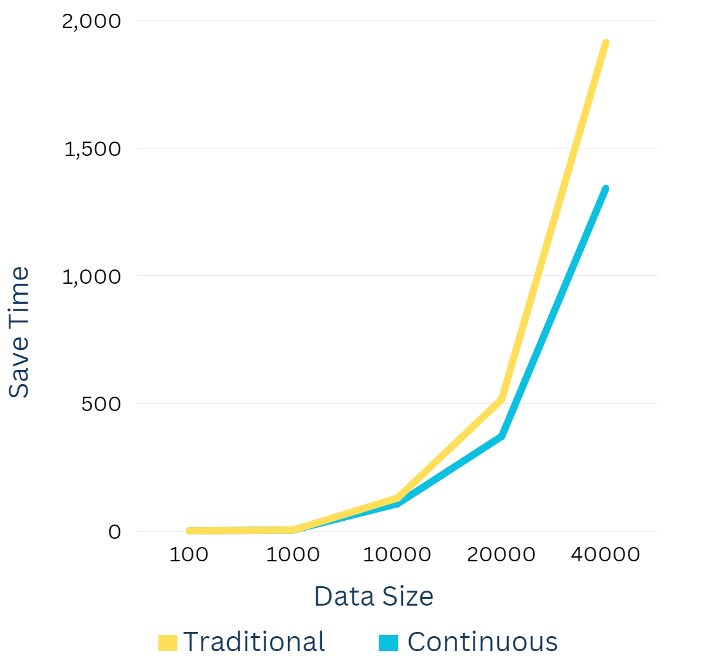
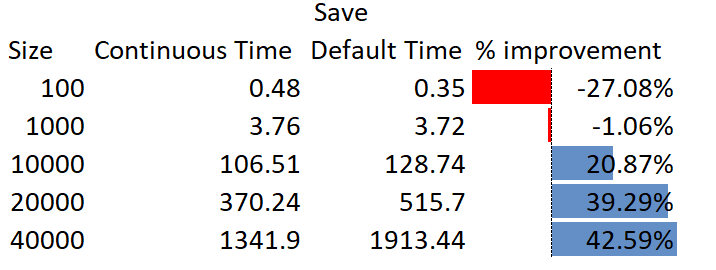

Continuous Checkpointing for Deep Learning Recommendation Model for Personalization and Recommendation Systems:
=================================================================================


Description:
------------
An implementation of a deep learning recommendation model (DLRM) i

Training deep learning models on large datasets is a resource-intensive process that often spans hours or even weeks. Any interruption or crash during this period can lead to substantial loss of data, time, and computational effort. In order to prevent that, we can checkpoint the models during the training process. The baseline Deep Learning Recommendation Model makes use of traditional checkpointing functionalities wherein the entire model is saved at certain intervals. However, this approach results in checkpoints that can significantly burden storage resources due to their size. 

In this project, we set out to resolve this issue faced by Facebook's DLRM code using a continuous checkpointing system. We use the Facebook's DLRM code to make adjustments and implement the continuous checkpointing. The continuous checkpointing mechanism not only allows the model to resume precisely where it left off in the event of a disruption but also streamlines the overall computational process by reducing storage demands. Therefore, the ultimate motivation of this project is to enhance the efficiency and reliability of training large deer learning recommendation models.


Continuous Checkpoints:

Continuous checkpointing is a technique that allows for the real-time storage of model checkpoints in deep-learning recommendation models. Instead of saving checkpoints at predetermined intervals, continuous checkpointing saves the model's parameters to disk at regular intervals during training. It reduces the risk of data loss since the model's parameters are saved to disk at regular intervals, rather than waiting for a predetermined checkpoint. It also provides real-time updates of the model's parameters, allowing the training process to be paused or resumed at any time without having to wait for a predetermined checkpoint. This technique is more efficient in terms of time and computational resources, as it eliminates the need to re-compute intermediate results.

The preference for splitting the embedding table from the rest of the model, instead of storing the entire model at regular intervals, is primarily motivated by the enormous volume of data that the embedding table has. This improves the system's efficiency by lowering not only the storage requirements but also the I/O load during the checkpointing procedure.
An essential component of our strategy is the continuous writing of the embedding table entries and markers to Kafka. This real-time logging system enables us to capture the highly dynamic nature of the embedding table, as well as mark the storage of the rest of the model by the markers. By using Kafka, we leverage its fault-tolerant and distributed nature to ensure the reliability and consistency of our checkpointing system.
Storing the rest of the model - such as weights and biases of other layers and other variables - in the Disk File System is because these components typically don't change as rapidly as the embedding table. So we can take advantage of the lesser storage size (<1%) without compromising on our ability to restore the model. 
The system incorporates effective mechanisms for managing checkpoints and their synchronization by using the markers in the kafka stream. This ensures not only the integrity and consistency of the model across checkpoints but also provides the flexibility to pause and restart the model as required from the latest marker. This enables users to manage long-running training processes more efficiently.





```
output:

Cite [Work](https://arxiv.org/abs/1906.00091):
```
@article{DLRM19,
  author    = {Maxim Naumov and Dheevatsa Mudigere and Hao{-}Jun Michael Shi and Jianyu Huang and Narayanan Sundaraman and Jongsoo Park and Xiaodong Wang and Udit Gupta and Carole{-}Jean Wu and Alisson G. Azzolini and Dmytro Dzhulgakov and Andrey Mallevich and Ilia Cherniavskii and Yinghai Lu and Raghuraman Krishnamoorthi and Ansha Yu and Volodymyr Kondratenko and Stephanie Pereira and Xianjie Chen and Wenlin Chen and Vijay Rao and Bill Jia and Liang Xiong and Misha Smelyanskiy},
  title     = {Deep Learning Recommendation Model for Personalization and Recommendation Systems},
  journal   = {CoRR},
  volume    = {abs/1906.00091},
  year      = {2019},
  url       = {https://arxiv.org/abs/1906.00091},
}
```

Related Work:

On the [system architecture implications](https://arxiv.org/abs/1906.03109), with DLRM as one of the benchmarks,
```
@article{ArchImpl19,
  author    = {Udit Gupta and Xiaodong Wang and Maxim Naumov and Carole{-}Jean Wu and Brandon Reagen and David Brooks and Bradford Cottel and Kim M. Hazelwood and Bill Jia and Hsien{-}Hsin S. Lee and Andrey Malevich and Dheevatsa Mudigere and Mikhail Smelyanskiy and Liang Xiong and Xuan Zhang},
  title     = {The Architectural Implications of Facebook's DNN-based Personalized Recommendation},
  journal   = {CoRR},
  volume    = {abs/1906.03109},
  year      = {2019},
  url       = {https://arxiv.org/abs/1906.03109},
}
```

On the [embedding compression techniques (for number of vectors)](https://arxiv.org/abs/1909.02107), with DLRM as one of the benchmarks,
```
@article{QuoRemTrick19,
  author    = {Hao{-}Jun Michael Shi and Dheevatsa Mudigere and Maxim Naumov and Jiyan Yang},
  title     = {Compositional Embeddings Using Complementary Partitions for Memory-Efficient Recommendation Systems},
  journal   = {CoRR},
  volume    = {abs/1909.02107},
  year      = {2019},
  url       = {https://arxiv.org/abs/1909.02107},
}
```

On the [embedding compression techniques (for dimension of vectors)](https://arxiv.org/abs/1909.11810), with DLRM as one of the benchmarks,
```
@article{MixDimTrick19,
  author    = {Antonio Ginart and Maxim Naumov and Dheevatsa Mudigere and Jiyan Yang and James Zou},
  title     = {Mixed Dimension Embeddings with Application to Memory-Efficient Recommendation Systems},
  journal   = {CoRR},
  volume    = {abs/1909.11810},
  year      = {2019},
  url       = {https://arxiv.org/abs/1909.11810},
}
```

Implementation
--------------

Step 1: Perform the required installations, and download the project contents into a directory.

Step 2: Download and install the Kafka services, and then start the Kafka zookeeper, and server, and create a Kafka topic. Another topic will need to be created if log compaction is to be tested. After navigating to the installed Kafka location, run the below commands to perform the above operations.

Command to start Kafka Zookeeper: 
.\bin\windows\zookeeper-server-start.bat .\config\zookeeper.properties

Command to start Kafka Server: 
.\bin\windows\kafka-server-start.bat .\config\server.properties

Command to create a topic:
.\bin\windows\kafka-topics.bat --create --topic topic_name --bootstrap-server localhost:9092

Step 3: Download the project file from the github repository. Using the terminal, navigate to the project directory where the DLRM files are (dlrm_s_pytorch.py) located. This can be done using the cd command in the terminal.


Step 4: The current approach involves stopping the model during the 4th epoch and then reloading embeddings to continue training to simulate model failure and recovery is done by the following commands.
Command to perform save operation locally:
python dlrm_s_pytorch.py --mini-batch-size=50 --data-size=10000 --nepochs 3 --save-model-continuous yes

Command to perform load operation locally:
python dlrm_s_pytorch.py --mini-batch-size=50 --data-size=10000 --nepochs 8 --load-model-continuous yes

Command to perform save operation in kafka:
python dlrm_s_pytorch.py --mini-batch-size=50 --data-size=10000 --nepochs 3 --save-model-continuous yes --save-model-kafka yes --kafka-topic topicName

Command to perform load operation in kafka:
python dlrm_s_pytorch.py --mini-batch-size=50 --data-size=10000 --nepochs 8 --load-model-continuous yes --load-model-kafka yes --kafka-topic topicName

Here, the number of epochs, data size, mini-batch size, and kafka topic can be modified as required.


Benchmarking
------------




From the experiments run, we can see that the time taken to save the model in continuous checkpoints gradually reduces as the data size increases and, in turn, performs better than the default DLRM saving mechanism. However, this pattern is not seen while loading the model, the time difference between the Continuous checkpoints and DLRM is very minimal. The DLRM outperforms the Continuous checkpoints by a minute margin. This might be due to the fact that we process the messages from the Kafka stream and load them to the latest marker through nested loops.  However, the improvement in saving performance by the Continuous checkpoints outweighs the minimal drawback in the loading mechanism. 


Reference
---------

https://github.com/facebookresearch/dlrm
